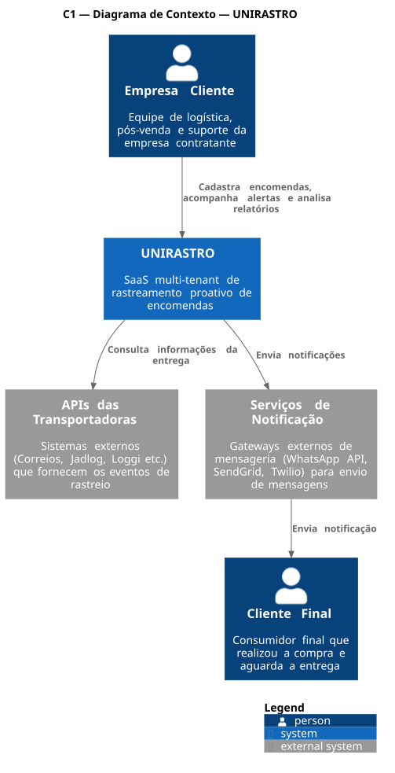
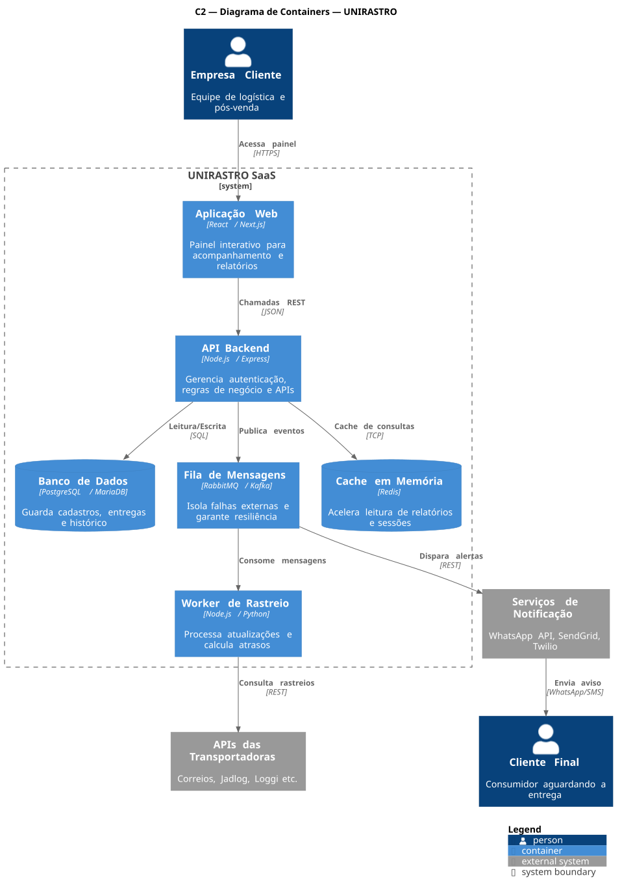
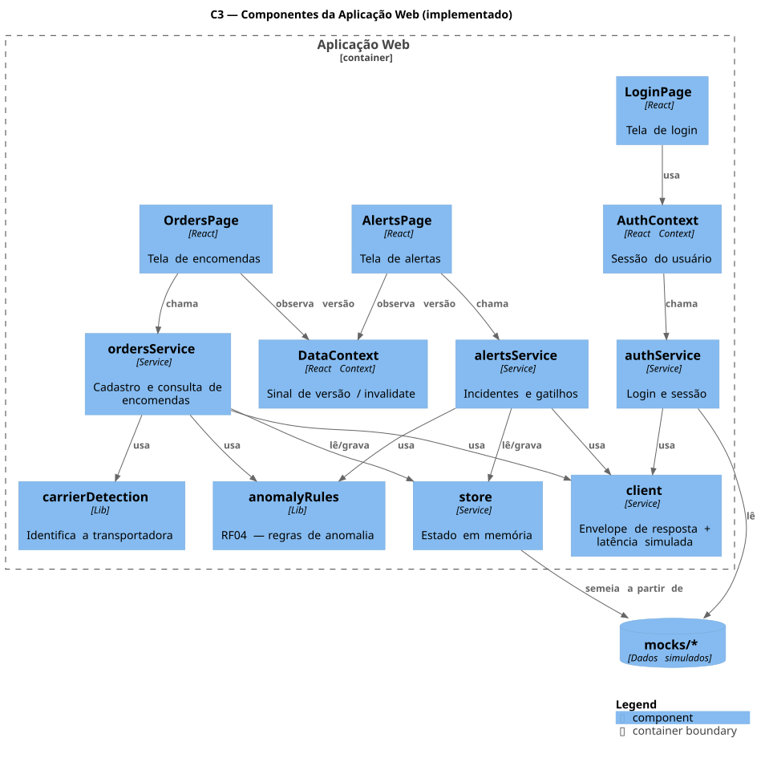
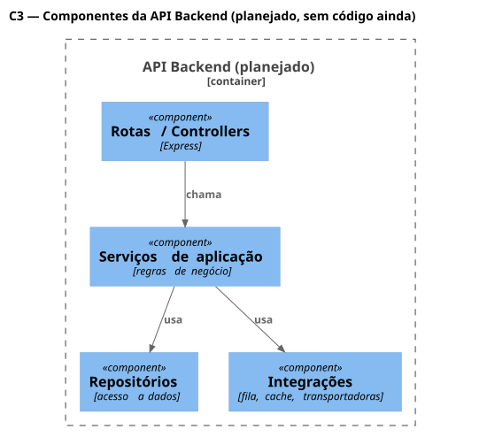
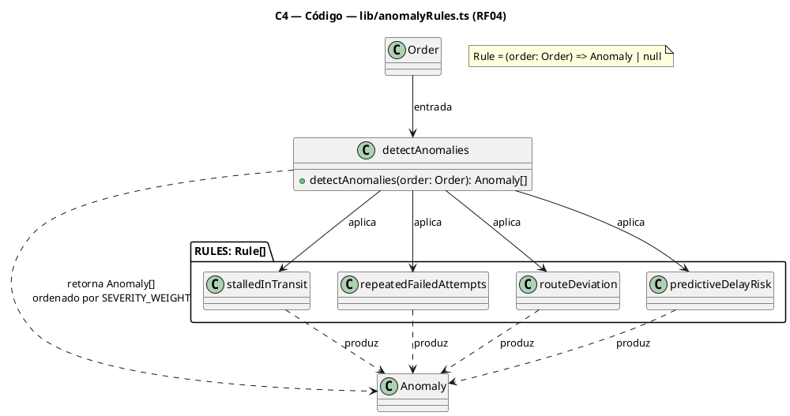
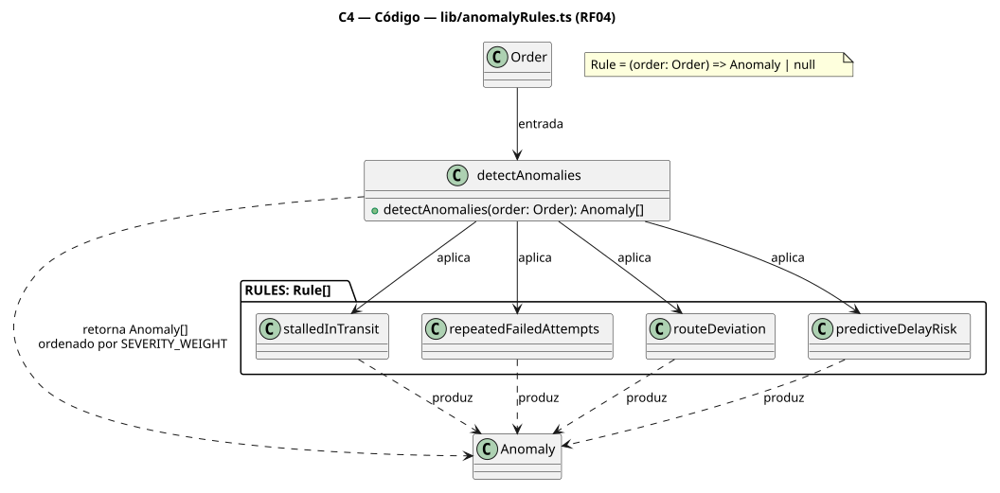

# UNIRASTRO — Painel operacional

Frontend do UNIRASTRO, um SaaS multi-tenant de rastreamento de encomendas.

A proposta não é mostrar onde o pacote está, porque o site da transportadora já faz isso. É
perceber que algo saiu do previsto **antes** do prazo estourar, para que a empresa avise o
cliente final em vez de ser cobrada por ele.

Esta é a entrega parcial de frontend (cerca de 35% do previsto). O backend não existe ainda:
os dados vêm de mocks locais atrás de uma camada de serviços preparada para ser trocada por
chamadas HTTP.

## Objetivo do produto

O UNIRASTRO é para quem despacha a encomenda, não para quem espera ela. A empresa cliente já
sabe rastrear pacote — o site de cada transportadora faz isso, e sites como
melhorrastreio.com.br agregam vários. O que falta é alguém avisando **antes** de o cliente
final ligar reclamando: pacote parado tempo demais na mesma filial, tentativa de entrega
frustrada, rota que saiu do previsto. O sistema aplica essas regras sobre o histórico de
eventos e levanta o incidente com antecedência, para a empresa decidir se e como avisa o
cliente final — ela fala primeiro, em vez de ser cobrada depois.

A mesma base de eventos alimenta relatórios de qualidade de entrega por transportadora e
região (tempo médio de trânsito, pontualidade, sinistros e reentrega), para orientar decisão
de qual transportadora usar em qual rota. Essa parte analítica (RF07/RF09) ainda não está
nesta entrega — ver [Próximas etapas](#próximas-etapas).

## Público-alvo

- **Empresa cliente** (público primário — quem usa o painel): equipe de logística, pós-venda
  e suporte da empresa que despacha as encomendas. Cadastra pedidos, configura os gatilhos de
  alerta e resolve incidentes.
- **Cliente final** (público indireto): o consumidor esperando a encomenda. Não acessa o
  painel — só recebe a notificação proativa quando a empresa decide avisá-lo, a partir de um
  incidente marcado como notificado na central de alertas.

## Como rodar

```bash
npm install
npm run dev
```

A aplicação sobe em `http://localhost:5173`.

### Credenciais de teste

Também aparecem na própria tela de login, com um clique para preencher.

| Papel | E-mail | Senha | Empresa |
| --- | --- | --- | --- |
| Operador de Logística | marina@aurora.com.br | operador | Aurora Comércio |
| Admin | carlos@aurora.com.br | admin | Aurora Comércio |
| Suporte | tais@aurora.com.br | suporte | Aurora Comércio |
| Operador de Logística | diego@bonsai.com.br | bonsai | Bonsai Distribuidora |

As três primeiras contas pertencem à mesma empresa e servem para comparar permissões. A
quarta é de outra empresa e serve para verificar o isolamento multi-tenant: entrar com ela
não revela nenhuma encomenda da Aurora.

### Outros comandos

```bash
npm run typecheck   # checagem de tipos
npm run build       # build de produção
npm run lint        # análise estática
```

## Arquitetura

O padrão é **Cliente-Servidor** (RNF01). O frontend não conhece regra de persistência, e o
backend não conhece tela. Nesta entrega o servidor é simulado, mas a fronteira já está no
lugar certo.

```
src/
  types/        modelo de domínio
  mocks/        dados simulados
  services/     fronteira com o backend
  lib/          regras de domínio puras
  contexts/     sessão, avisos e sincronização
  components/   layout, interface e componentes por área
  pages/        telas, agrupadas por área
```

A regra que sustenta a separação: **as páginas nunca importam de `mocks/`, só de
`services/`.** Quando o backend existir, apenas os arquivos de `services/` trocam o mock por
`fetch`, e nenhuma tela muda.

Os serviços devolvem sempre o mesmo envelope, `{ success, message, errors, data }`, que é o
formato da API do outro projeto da disciplina. Manter a simetria significa que a troca não
mexe em como as telas leem a resposta.

Duas decisões que valem explicação:

**Latência artificial.** Todo serviço espera de 300 a 600 ms antes de responder. Uma tela que
nunca espera esconde exatamente os defeitos que aparecem quando o backend entra. O RNF03 fala
em consistência eventual, então esperar é o comportamento normal, não a exceção.

**Incidentes derivados, não armazenados.** A central de alertas não lê uma tabela de
incidentes. Ela aplica as regras de anomalia sobre as encomendas a cada consulta. Uma lista
gravada envelheceria em silêncio, e um pacote que voltasse a se mover continuaria aparecendo
como parado. O que persiste é só a decisão humana: quais incidentes o operador resolveu.

O detalhamento por container está no [Modelo C4](#modelo-c4) a seguir.

## Ferramentas e tecnologias

### Em uso nesta entrega

| Camada | Ferramenta | Motivo |
| --- | --- | --- |
| Framework | React 19.2 + TypeScript ~6.0 | tipagem estática no modelo de domínio — RF03 e RF04 dependem de eventos bem tipados |
| Build | Vite 8.3 | dev server rápido, build de produção sem configurar bundler à mão |
| Roteamento | react-router-dom 7.9 | rotas protegidas por papel (RF10) sem reimplementar guarda de navegação |
| Lint | oxlint 1.81 | feedback quase instantâneo, com `react/rules-of-hooks` como erro |
| Estilo | CSS Modules + `src/styles/tokens.css` | escopo por componente sem runtime de CSS-in-JS; tokens centralizados de cor, tipografia e espaçamento |
| Tipografia | Sora, IBM Plex Sans, IBM Plex Mono (Google Fonts) | títulos, corpo, e números/códigos de rastreio, respectivamente |

### Planejado para o backend (ainda não implementado)

Vem do C2 do modelo C4 e dos requisitos não funcionais:

| Camada | Ferramenta | Motivo |
| --- | --- | --- |
| API | Node.js / Express | mesma linguagem do frontend, reduz custo de contexto ao trocar mock por chamada real |
| Banco de dados | PostgreSQL / MariaDB | dados relacionais — pedidos, eventos, tenants, usuários — com integridade referencial |
| Fila de mensagens | RabbitMQ / Kafka | desacopla a consulta às transportadoras do resto do sistema (RNF03) |
| Cache | Redis | acelera a leitura do painel e de dados consultados com frequência (RNF04) |
| Worker de rastreio | Node.js / Python | processa consultas e webhooks das transportadoras de forma assíncrona |

## Modelo C4

Os quatro níveis estão em **PlantUML**, com a notação C4-PlantUML (`Person`, `System`,
`Container`, `Component`, `Rel`). Cada seção tem o código-fonte, para reeditar ou regerar
quando o backend existir, e logo abaixo o SVG já renderizado e versionado em
`docs/diagrams/` — não depende de nenhum serviço externo para aparecer no GitHub.

### C1 — Contexto

```plantuml
@startuml C1-Contexto
!include https://raw.githubusercontent.com/plantuml-stdlib/C4-PlantUML/master/C4_Context.puml

title C1 — Diagrama de Contexto — UNIRASTRO

Person(empresaCliente, "Empresa Cliente", "Equipe de logística, pós-venda e suporte da empresa contratante")
System(unirastro, "UNIRASTRO", "SaaS multi-tenant de rastreamento proativo de encomendas")
System_Ext(transportadoras, "APIs das Transportadoras", "Sistemas externos (Correios, Jadlog, Loggi etc.) que fornecem os eventos de rastreio")
System_Ext(notificacao, "Serviços de Notificação", "Gateways externos de mensageria (WhatsApp API, SendGrid, Twilio) para envio de mensagens")
Person(clienteFinal, "Cliente Final", "Consumidor final que realizou a compra e aguarda a entrega")

Rel(empresaCliente, unirastro, "Cadastra encomendas, acompanha alertas e analisa relatórios")
Rel(unirastro, transportadoras, "Consulta informações da entrega")
Rel(unirastro, notificacao, "Envia notificações")
Rel(notificacao, clienteFinal, "Envia notificação")

SHOW_LEGEND()
@enduml
```



### C2 — Containers

```plantuml
@startuml C2-Containers
!include https://raw.githubusercontent.com/plantuml-stdlib/C4-PlantUML/master/C4_Container.puml

title C2 — Diagrama de Containers — UNIRASTRO

Person(empresaCliente, "Empresa Cliente", "Equipe de logística e pós-venda")

System_Boundary(saas, "UNIRASTRO SaaS") {
  Container(web, "Aplicação Web", "React / Next.js", "Painel interativo para acompanhamento e relatórios")
  Container(api, "API Backend", "Node.js / Express", "Gerencia autenticação, regras de negócio e APIs")
  ContainerDb(db, "Banco de Dados", "PostgreSQL / MariaDB", "Guarda cadastros, entregas e histórico")
  Container(queue, "Fila de Mensagens", "RabbitMQ / Kafka", "Isola falhas externas e garante resiliência")
  Container(worker, "Worker de Rastreio", "Node.js / Python", "Processa atualizações e calcula atrasos")
  ContainerDb(cache, "Cache em Memória", "Redis", "Acelera leitura de relatórios e sessões")
}

System_Ext(transportadoras, "APIs das Transportadoras", "Correios, Jadlog, Loggi etc.")
System_Ext(notificacao, "Serviços de Notificação", "WhatsApp API, SendGrid, Twilio")
Person(clienteFinal, "Cliente Final", "Consumidor aguardando a entrega")

Rel(empresaCliente, web, "Acessa painel", "HTTPS")
Rel(web, api, "Chamadas REST", "JSON")
Rel(api, cache, "Cache de consultas", "TCP")
Rel(api, db, "Leitura/Escrita", "SQL")
Rel(api, queue, "Publica eventos")
Rel(queue, worker, "Consome mensagens")
Rel(worker, transportadoras, "Consulta rastreios", "REST")
Rel(queue, notificacao, "Dispara alertas", "REST")
Rel(notificacao, clienteFinal, "Envia aviso", "WhatsApp/SMS")

SHOW_LEGEND()
@enduml
```



Web, Backend, Banco, Fila, Worker e Cache são o C2 completo previsto no documento de
requisitos. Apenas a **Aplicação Web** está implementada nesta entrega — os demais containers
são a estrutura planejada para o backend (ver [Ferramentas e tecnologias](#ferramentas-e-tecnologias)
e [Próximas etapas](#próximas-etapas)).

### C3 — Componentes

Zoom no container **Aplicação Web** (implementado nesta entrega — nomes reais dos módulos):

```plantuml
@startuml C3-AplicacaoWeb
!include https://raw.githubusercontent.com/plantuml-stdlib/C4-PlantUML/master/C4_Component.puml

LAYOUT_WITH_LEGEND()
title C3 — Componentes da Aplicação Web (implementado)

Container_Boundary(web, "Aplicação Web") {
  Component(login, "LoginPage", "React", "Tela de login")
  Component(orders, "OrdersPage", "React", "Tela de encomendas")
  Component(alerts, "AlertsPage", "React", "Tela de alertas")

  Component(authCtx, "AuthContext", "React Context", "Sessão do usuário")
  Component(dataCtx, "DataContext", "React Context", "Sinal de versão / invalidate")

  Component(authSvc, "authService", "Service", "Login e sessão")
  Component(ordersSvc, "ordersService", "Service", "Cadastro e consulta de encomendas")
  Component(alertsSvc, "alertsService", "Service", "Incidentes e gatilhos")
  Component(store, "store", "Service", "Estado em memória")
  Component(client, "client", "Service", "Envelope de resposta + latência simulada")

  Component(carrier, "carrierDetection", "Lib", "Identifica a transportadora")
  Component(anomaly, "anomalyRules", "Lib", "RF04 — regras de anomalia")
}

ComponentDb(mocks, "mocks/*", "Dados simulados")

Rel(login, authCtx, "usa")
Rel(authCtx, authSvc, "chama")
Rel(orders, dataCtx, "observa versão")
Rel(orders, ordersSvc, "chama")
Rel(alerts, dataCtx, "observa versão")
Rel(alerts, alertsSvc, "chama")

Rel(ordersSvc, carrier, "usa")
Rel(ordersSvc, anomaly, "usa")
Rel(ordersSvc, store, "lê/grava")
Rel(ordersSvc, client, "usa")

Rel(alertsSvc, anomaly, "usa")
Rel(alertsSvc, store, "lê/grava")
Rel(alertsSvc, client, "usa")

Rel(authSvc, mocks, "lê")
Rel(authSvc, client, "usa")
Rel(store, mocks, "semeia a partir de")

SHOW_LEGEND()
@enduml
```



`DataContext` não busca dado nenhum — só guarda uma versão que `OrdersPage` e `AlertsPage`
observam para saber quando reconsultar o serviço depois de uma mutação (ex.: resolver um
incidente). Quem fala com o serviço é a própria página.

Zoom no container **API Backend** (planejado — ainda não existe código, é a estrutura em
camadas prevista para quando ele for escrito):

```plantuml
@startuml C3-APIBackend
!include https://raw.githubusercontent.com/plantuml-stdlib/C4-PlantUML/master/C4_Component.puml

title C3 — Componentes da API Backend (planejado, sem código ainda)

Container_Boundary(api, "API Backend (planejado)") {
  Component(routes, "Rotas / Controllers", "Express")
  Component(appsvc, "Serviços de aplicação", "regras de negócio")
  Component(repo, "Repositórios", "acesso a dados")
  Component(integr, "Integrações", "fila, cache, transportadoras")
}

Rel(routes, appsvc, "chama")
Rel(appsvc, repo, "usa")
Rel(appsvc, integr, "usa")
@enduml
```



### C4 — Código

Zoom no trecho mais relevante do produto, `lib/anomalyRules.ts` (RF04, implementado). No nível
de código o próprio C4 recomenda notação livre — aqui é um diagrama de classes simples:





Cada regra é uma função pura `(order) => Anomaly | null`, sem estado de tela — testável isolada
e fácil de mover para o backend depois, que é onde vai rodar de fato.

## Requisitos funcionais

RF08 não existe: a numeração original salta de RF07 para RF09.

| Requisito | Descrição | Status |
| --- | --- | --- |
| RF01 Cadastro de pedidos | Cadastro manual de dados de envio e código de rastreio, com identificação automática da transportadora | Implementado — `lib/carrierDetection.ts`, modal de cadastro |
| RF02 Consulta automática de status | Consulta periódica e assíncrona do status junto às APIs das transportadoras (ou via webhook) | Implementado (simulado) — `services/ordersService.ts`, botão de atualizar na gaveta |
| RF03 Histórico unificado | Timeline padronizada de eventos de movimentação, independente da transportadora | Implementado — `components/orders/Timeline.tsx` |
| RF04 Detecção de anomalias / atrasos preditivos | Identificação automática de inconsistências no transporte antes do prazo expirar | Implementado — `lib/anomalyRules.ts` |
| RF05 Gatilhos de notificação | Parametrização de quais eventos e atrasos disparam alerta proativo ao cliente final | Implementado — `components/alerts/TriggerPanel.tsx` |
| RF06 Painel de alertas operacionais | Central de incidentes | Implementado — `pages/alerts/AlertsPage.tsx` |
| RF07 Dashboard de desempenho por transportadora | Relatórios comparativos de qualidade de entrega por transportadora e região | Não implementado nesta entrega — desenhado no protótipo, item desabilitado na navegação |
| RF09 Exportação e filtros analíticos | Filtro de relatórios por período, status, região e transportadora | Não implementado nesta entrega — depende do RF07 |
| RF10 Multi-tenant e permissões | Isolamento de dados por empresa cliente e usuários com papéis distintos | Implementado — `contexts/AuthContext.tsx`, `services/authService.ts` |

### RF01 — identificação automática da transportadora

O usuário cola o código e a transportadora aparece enquanto ele digita, sem lista para
escolher. Quem cadastra cinquenta códigos por dia não quer selecionar a transportadora
cinquenta vezes, e o código já carrega essa informação.

| Transportadora | Formato |
| --- | --- |
| Correios | duas letras, nove dígitos, duas letras |
| Jadlog | catorze dígitos |
| Loggi | prefixo LG e dez dígitos |
| Total Express | prefixo TE e doze dígitos |

São aproximações didáticas. Formatos reais mudam e se sobrepõem entre operadores. Em produção
o palpite serviria apenas para escolher qual API consultar primeiro, e a confirmação viria da
resposta da própria transportadora.

### RF04 — as quatro regras de anomalia

É o núcleo do produto e o trecho de código mais interessante para revisar.

| Regra | Dispara quando | Severidade |
| --- | --- | --- |
| Parada prolongada | último evento há mais de 36h no mesmo local | crítico ou atenção, conforme o prazo |
| Tentativa frustrada | duas ou mais tentativas sem sucesso | crítico |
| Rota desviada | evento registrado fora da rota planejada | crítico ou atenção, conforme o prazo |
| Risco de atraso preditivo | prazo termina hoje ou amanhã e o pacote não saiu para entrega | crítico |

A quarta é a mais valiosa, porque dispara enquanto ainda dá tempo de agir, mesmo quando nada
até ali parece errado.

O limite de 36 horas é o mesmo número que aparece no gatilho "Parada prolongada" na tela de
alertas. O que o operador parametriza e o que a regra aplica precisam ser a mesma coisa.

### RF05 e RF06 — como se encaixam

O estado de cada gatilho decide se um incidente daquele tipo aparece como notificado ao
cliente final. Desligar "Rota desviada" faz os desvios passarem a aparecer sem a marca de
aviso enviado. É a parametrização do operador produzindo efeito visível na central.

### RF10 — permissões

| Ação | Admin | Operador | Suporte |
| --- | --- | --- | --- |
| Cadastrar encomenda | sim | sim | não |
| Alterar gatilhos | sim | sim | não |
| Resolver incidentes | sim | sim | sim |

Suporte enxerga a configuração de gatilhos, mas não a altera. Mudar um gatilho muda o que
milhares de clientes finais recebem, e isso é decisão de quem responde pela operação.

## Requisitos não funcionais

| Requisito | Descrição | Situação nesta entrega |
| --- | --- | --- |
| RNF01 Arquitetura Cliente-Servidor | Interface web/mobile desacoplada da API central responsável por regras de negócio, persistência e integrações | Já refletido: `services/` isola o frontend de qualquer detalhe de persistência |
| RNF02 Alta disponibilidade com redundância | Uptime de 99,9%, redundância de servidores e monitoramento ativo | Depende do backend — não existe ainda |
| RNF03 Resiliência e consistência eventual | Fila de mensagens e retry com exponential backoff, priorizando disponibilidade sobre consistência imediata | Simulado parcialmente: latência artificial de 300–600ms em todo serviço antecipa o comportamento assíncrono |
| RNF04 Desempenho via cache em memória | Cache (Redis) para acelerar a resposta do painel | Depende do backend — não existe ainda |

## Dados simulados

Os dados são ancorados no momento em que a aplicação carrega, nunca em datas fixas. A
encomenda parada continua parada há 52 horas em qualquer dia que o projeto for apresentado, e
as regras disparam de verdade em vez de ler um campo pronto.

Recarregar a página devolve tudo ao estado inicial. Para uma entrega de frontend isso é
aceitável, e até conveniente numa apresentação.

Os casos foram escolhidos de propósito: uma parada longa, duas tentativas frustradas, um
desvio de rota, entregas normais e uma recém postada. Sem essa variedade a central de
incidentes apareceria vazia.

## Design

O visual segue o protótipo feito no Claude Design, preservado em `design/` para consulta.

Os valores de cor, tipografia e espaçamento estão em `src/styles/tokens.css`. Vale um aviso
sobre um detalhe fácil de estragar: **nada tem cantos arredondados**, exceto as etiquetas de
contagem, os interruptores de gatilho e os pontos indicadores. É a assinatura do design e não
deve ser suavizado.

As fontes são Sora para títulos, IBM Plex Sans para corpo e IBM Plex Mono para códigos de
rastreio e números.

O protótipo é HTML de mockup, não código de produção. A estrutura interna dele não foi
copiada, só o resultado visual. Onde valeu a pena divergir, divergiu: a listagem de
encomendas é uma tabela de verdade, e não uma grade de divisões, porque um leitor de tela
precisa da relação entre cabeçalho e célula para anunciar "Status: Parado" em vez de ler seis
valores soltos.

## Próximas etapas

Registrado aqui porque delimitar o escopo faz parte da entrega.

- **Backend, banco de dados, fila de mensagens e cache** (RNF02, RNF03 e RNF04) — a API real,
  substituindo a camada de mocks por chamadas HTTP, sem mudar nenhuma tela.
- **Tela de Desempenho por transportadora** (RF07 e RF09). Já está desenhada no protótipo,
  com gráficos comparativos, filtros por período e região, e exportação. Aparece desabilitada
  na navegação, marcada como próxima entrega.
- **C3 e C4 do container API Backend.** O C3/C4 da Aplicação Web já está no modelo; o do
  backend é só a estrutura em camadas prevista, porque o código ainda não existe.
- **Integração real com APIs de transportadoras.**
- **Testes automatizados.**
